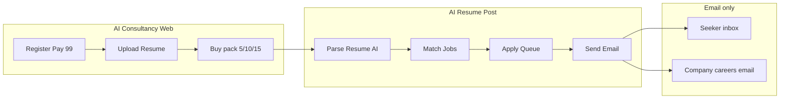

# Full working model — AI Consultancy + AI Resume Post backend

## Product split (two apps, one database)

| App | Users | Channel | Purpose |
|-----|--------|---------|---------|
| **AI Consultancy** (public) | Job seekers | Web + **email only** | Pay ₹99 register, upload resume, buy outreach packs |
| **AI Resume Post** (internal/backend) | You + automation | Admin UI + workers | Match jobs, queue applications, log status, notify seeker by email |

Both share: `seekers`, `resumes`, `packages`, `applications`, `email_log`.

## Money model (you can change numbers later)

| SKU | Suggested price | What buyer gets |
|-----|-----------------|-----------------|
| REG-99 | ₹99 one-time | Profile + resume on file + AI resume review email |
| POST-5 | +₹299–499 | Up to 5 targeted outreach actions |
| POST-10 | +₹499–799 | 10 actions |
| POST-15 | +₹699–999 | 15 actions |
| POST-20/30 | Custom | Volume / premium targeting |

An **action** = one company-role pair: either (1) email sent to official careers address with resume + cover letter, or (2) email to seeker with application link + materials (counts if you promise assisted apply).

## Email-only UX (no phone)

- Login: **magic link** to email (no SMS OTP).
- All receipts, status, “applied to Company X”: **transactional email**.
- Support: **reply-to** on emails or web form → creates ticket → answers by email.

## AI Resume Post worker (automation pipeline)

1. **Ingest** — PDF/DOCX upload → text extract (pdfminer or cloud OCR).
2. **Structure** — LLM or rules → skills, years, roles, locations, salary band.
3. **Match** — Score against job records (title, skills, experience min/max).
4. **Sources (allowed)**  
   - Your **curated company list** (careers URL + apply email).  
   - **Public job APIs** (e.g. Adzuna, some government portals).  
   - **RSS / career page** monitors you maintain.  
   - **NOT** LinkedIn logged-in scraping or auto-click Apply.
5. **Prepare** — Tailored subject + 150-word cover letter + resume PDF.
6. **Apply gate** — Rules: max N per day, only `careers@` / `jobs@` / listed HR emails, CAN-SPAM-style footer, seeker consent on file.
7. **Send** — SMTP API (Amazon SES, SendGrid, Resend).
8. **Notify seeker** — Template: company name, role, date, method (email apply / link), reference id.

## Tech stack (low cost, real deploy)

| Layer | Suggestion |
|-------|------------|
| Web | Next.js or static site on **Vercel**; forms → API |
| API | Python **FastAPI** or Vercel serverless (your repo already uses Python WSGI) |
| DB | **PostgreSQL** (Supabase free tier) or SQLite for MVP |
| Files | **Supabase Storage** / S3 — resumes private, encrypted at rest |
| Pay | **Razorpay** — ₹99 + pack add-ons |
| Email | **Resend** or **Amazon SES** (domain DKIM required) |
| Queue | **Redis** (Upstash free) or DB-backed job table + cron |
| AI | OpenAI / AssemblyAI / local — resume parse + match + cover letter |

## What you must provide

### Business & legal (India)

- Proprietorship or **Pvt Ltd** (recommended if scaling).
- **GST** if turnover requires; mention GST on invoice if registered.
- **Privacy policy** + **Terms** (consent to apply on seeker’s behalf, data retention, refund policy).
- **DPDP Act 2023** — lawful purpose, notice, deletion on request, reasonable security.
- Refund rule for ₹99 (e.g. no refund after resume processing starts).

### Technical

- Domain (e.g. `aijobconsultancy.in`).
- **Business email** on domain (`apply@`, `noreply@`) — not Gmail for bulk.
- Razorpay KYC business account.
- SPF + DKIM + DMARC on domain (critical for deliverability).

### Operations

- **Curated list** of 50–200 companies you actually support in v1 (role families: IT, sales, etc.).
- Decision: **email apply** vs **link-only** per company.
- Human review step until automation is trusted (recommended first 100 seekers).

## Publicity (after MVP works)

Free / open channels (no phone in product):

| Channel | Action |
|---------|--------|
| **GitHub** | Open-source landing page or “job seeker toolkit”; link to your service |
| **Product Hunt** | Launch day |
| **Dev.to / Hashnode** | “How we built email-only job outreach” |
| **Reddit** | r/india, r/developersIndia — follow rules, no spam |
| **LinkedIn** | **Your** posts about service — do not automate applies |
| **Google Business** | If you have office address |
| **AlternativeTo / SaaS directories** | Free listings |
| **Hacker News** | Show HN when honest about limits |

## Phase plan

| Phase | Duration | Deliverable |
|-------|----------|-------------|
| 0 | Week 1 | Legal pages, Razorpay, email domain, 50 company list |
| 1 | Week 2–3 | Upload + ₹99 + welcome email |
| 2 | Week 4–5 | Packages 5/10/15 + payment + admin dashboard |
| 3 | Week 6–8 | Worker: match + email apply + seeker notifications |
| 4 | Ongoing | More companies, better AI matching, metrics |

## Success metrics

- Email delivery rate > 95%
- Apply completion logged per seeker
- Seeker NPS via email survey
- Chargeback/refund rate

See `build_consultancy_guide.py` for downloadable step-by-step DOCX for non-technical founder checklist.
